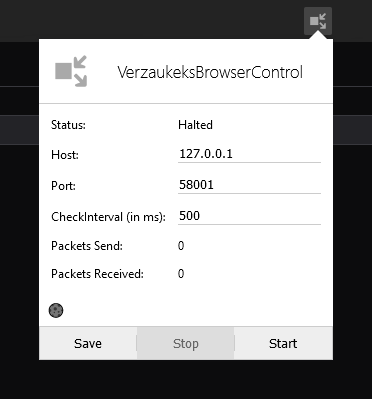

# VerzaukeksBrowserControl
Control your browser within your code
and get access to many useful features as if it were an add-on.

[Download Firefox-Addon Here](https://addons.mozilla.org/en-US/firefox/addon/verzaukeksbrowsercontrol/)

Download Chrome-Addon Here (not available / unstable and buggy)




### Kotlin Usage
````kotlin
val browser = Browser()
browser.start() // browser.start(port)

val tab = browser.newTab("https://example.com") // newTab(url, active)
val currentTab = browser.getCurrentTab()
val tabs = browser.getTabs()

browser.onTabCreated { println("New tab was created: $it") }
browser.onTabUpdated { println("A tab was updated: $it") }


val result = tab.executeScript("console.log('hello'); 'result value';") // executeScript(script, expectAnswer)
tab.insertCSS("* { background: red }")

tab.clickElement("button") // clickElement(selector, waitTillFinished)
tab.inputText("input", "custom text here") // inputText(selector, value, waitTillFinished)

val element = tab.querySelector("h1")
val elements = tab.querySelectorAll("div")

tab.updateInfo()
tab.reload() // tab.reload(bypassCache)
tab.remove()


browser.stop() // stop(clearListeners)
````
#### Dependencies
* [gson](https://github.com/google/gson)

### Python Usage
````python
from browser import Browser
from time import sleep

browser = Browser()
browser.start()  # browser.start(port)
browser.ping()

tab = browser.new_tab('https://example.com')  # new_tab(url, active)
current_tab = browser.get_current_tab()
tabs = browser.get_tabs()  # get_tabs(options)

browser.on_tab_created.append(lambda it: print(f'New tab was created: {it}'))
browser.on_tab_updated.append(lambda it: print(f'A tab was updated: {it}'))

result = tab.execute_script('console.log(\'hello\'); \'result value\';')  # execute_script(script, expect_answer)
tab.insert_css('* {background: red}')

tab.click_element('button')  # click_element(selector, wait_till_finished)
tab.input_text('input', 'custom text here')  # input_text(selector, value, wait_till_finished)

element = tab.query_selector('h1')
elements = tab.query_selector_all('div')

tab.update_info()
tab.reload()  # tab.reload(bypass_cache)
tab.remove()

sleep(1)
browser.stop()  # stop(clear_listeners)
````